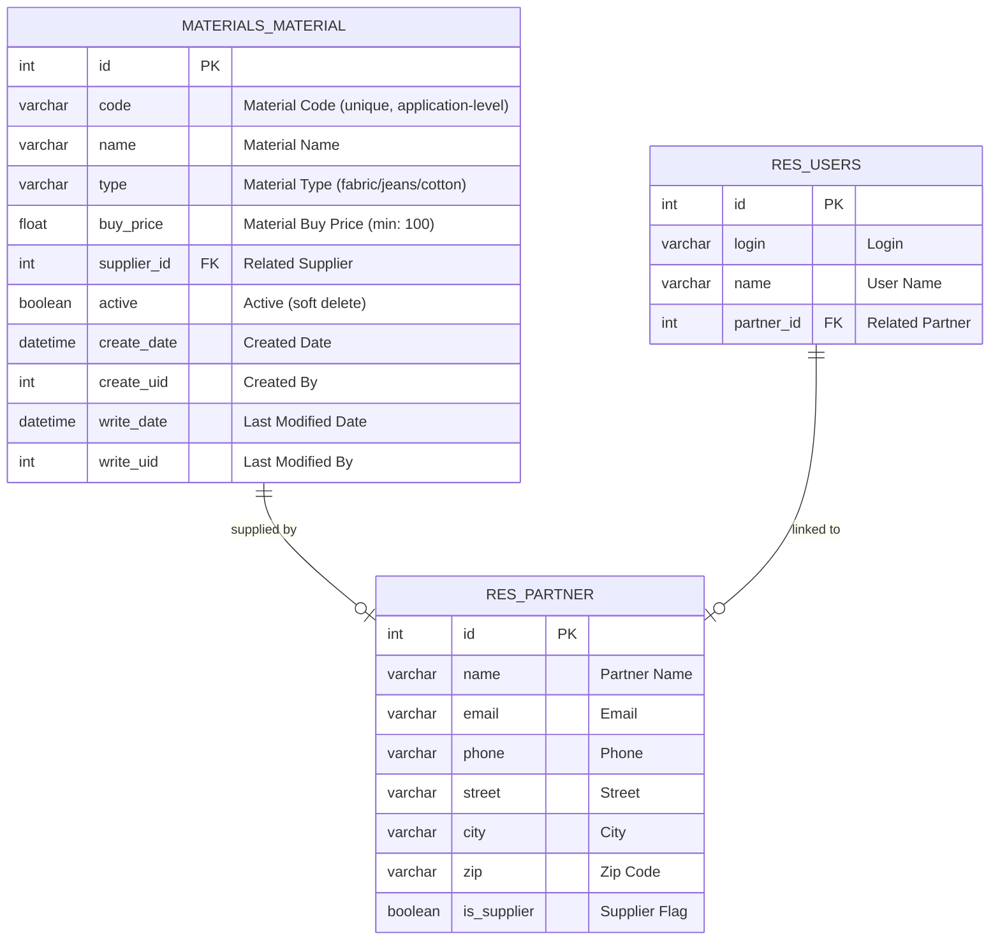

# Entity Relationship Diagram (ERD) - Materials Module

## Overview

This ERD describes the database schema for the Materials Management module in Odoo 14.

## ERD Diagram

## Relationships

| Relationship | Type | Description |
|--------------|------|-------------|
| `materials.material` → `res.partner` | Many2one | Each material has exactly one supplier (partner) |
| `res.users` → `res.partner` | One2one | Each user is linked to exactly one partner record |

## Field Descriptions

### materials.material

| Field | Type | Constraints | Description |
|-------|------|-------------|-------------|
| `id` | Integer | Primary Key | Auto-generated record ID |
| `code` | Char | Required, Unique (application-level) | Unique material code identifier |
| `name` | Char | Required | Human-readable material name |
| `type` | Selection | Required | Material type: fabric, jeans, or cotton |
| `buy_price` | Float | Required, Min: 100 | Purchase price per unit |
| `supplier_id` | Many2one | Required | Reference to supplier (res.partner) |

### res.partner (extension)

| Field | Type | Constraints | Description |
|-------|------|-------------|-------------|
| `is_supplier` | Boolean | Default: False | Flags partner as supplier for API filtering |

### Validation Rules

1. **Unique Code**: `code` must be unique across all material records
2. **Minimum Price**: `buy_price` must be greater than or equal to 100
3. **Required Fields**: All fields must be populated

## API Endpoints

| Endpoint | Method | Description |
|----------|--------|-------------|
| `GET /api/materials` | Read | List materials (with optional `?type=` filter) |
| `GET /api/materials/<id>` | Read | Get single material by ID |
| `POST /api/materials` | Create | Create new material |
| `PATCH /api/materials/<id>` | Update | Partial update material |
| `DELETE /api/materials/<id>` | Delete | Delete material |
| `GET /api/materials/available_types` | Read | List available material types |
| `GET /api/materials/suppliers` | Read | List partners with `is_supplier=True` |

## Security Model

| Group | Read | Write | Create | Delete |
|-------|------|-------|--------|--------|
| Internal User (`base.group_user`) | Yes | - | - | - |
| Settings Manager (`base.group_system`) | Yes | Yes | Yes | Yes |
